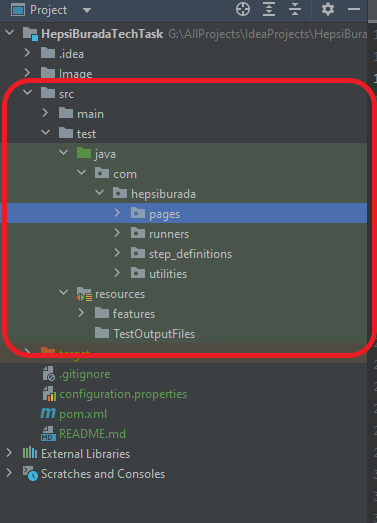

# PROJECT SUMMARY

* This project developed for Hepsiburada Interview Task
* **[Java 11.0.15](https://www.oracle.com/tr/java/technologies/javase/jdk11-archive-downloads.html)** was used as
  developing language
* **[Maven 3.8.5](https://maven.apache.org/download.cgi)** Build managment tool
* Cucumber Framework was used
* Project support multi OS
* Project support different browsers, selenium grid and parallel testing
* For reporting was used "maven-cucumber-reporting plugin" version "5.0.0"
* Project was developed with **[Intellij IDEA](https://www.jetbrains.com/idea/download/#section=windows)**
* You can find the task details on **[QA-Assignment-Hepsiburada](Files/QA-Assignment-hepsiburada.pdf)**

# SUMMARY OF STRUCTURE

* Project was developed by using cucumber framework. There is 4 main title
    * src folder ==> contains test codes and feature files (main body of code structure)
        * src folder structure like the below

      

        * java folder contain main code structure and resource folder contain feature/scenario files
            * POM design pattern was used in JAVA folder
            * pages package ==> Page Object Model that contains definition of relevant of each different page
            * runners package ==> contains runner class for run the project
            * step definition ==> contains relevant each step codes
            * utilities ==> contains utility classes for test run
        * resource folder ==> contains feature/execution files for scenarios which has written gherkin. And
          TestOutPutFiles folder for api results.
    * configuration.properties ==> contains several options like browser and URLs that using in the project;
    * pom.xml ==> contains dependencies, options, plugins that the project needs
* In additional, there is some detail tips in the relevant class for methods and classes

# TEST EXECUTION

* You must have relevant JAVA, maven, *
  *[Google Chrome (latest version)](https://www.google.com/chrome/?brand=YTUH&gclid=CjwKCAjwtcCVBhA0EiwAT1fY7-aU10CJz8sI-ncXx6atj1tzHjTWNsMKMop7LnpYodb5omvfq4pRYRoCnbAQAvD_BwE&gclsrc=aw.ds)
  **
* Clone the project to your local
* Project have been set the chrome option as default!!
* Open terminal in the folder and for run the test, provide the code following
  ```
  mvn test
  ```

    * If you want to run with other browser options, provide the code following
  ```
  mvn test -Dbrowser="firefox"  
  ```
  > Browser options: "chrome, chrome-headless, firefox, firefox-headless, ie, edge, safari, remote_chrome(selenium grid
  at aws EC2 machine)"
    * In addition to all these steps, If you want to run the test case with IDE you must to use cukesrunner class and
      just click the run button.
    * After test it will create an index.html file at "target/default-html-reports/index.html" directory.
    * And it will create "apiOutPut.txt" file at the "src/test/resources/TestOutputFiles" directory

### Developed by Vasudeva Rao Keerti

### vasukeerti@gmail.com